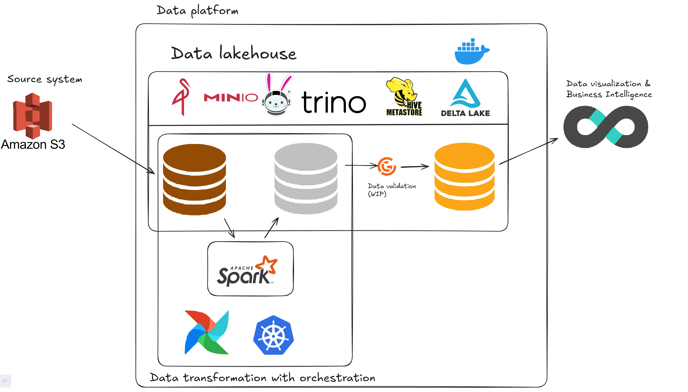
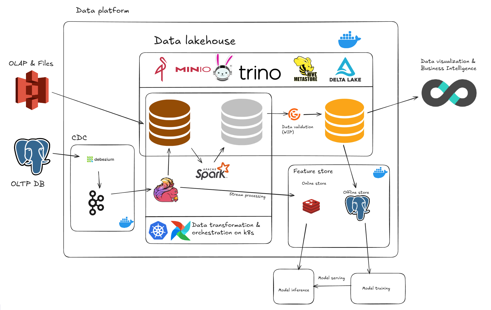

THIS PROJECT IS STILL WIP

Project: modern data platform 
Commit 3
Architecture overview



To do: 
- Add data govern
- Add data validation logic
- Fix airflow logs not shown on airflow UI
- Fix table format write fails

# Local Lakehouse + Spark on Minikube

## Prerequisites
Ensure your system has:
- Docker
- Kubernetes (Use kubernetes cluster created by Docker Desktop or Minikube or Kind)
- Python 3.12
- Helm
- Airflow deployed on K8s with Helm 
- Spark operator deployed on k8s with Helm

---

## Setup Python Environment

Create and activate a virtual environment, then install dependencies:


```bash
python3.12 -m venv .venv
source .venv/bin/activate
pip install -r requirements.txt
```

## Starting data lakehouse and minikube cluster
```bash
docker compose up -d
```
Go to docker desktop and create a K8s cluster

##Build docker image and push it to minikube cluster
```bash

```
##Submit spark job on k8s for data processing
```bash
kubectl apply -f spark-rbac.yaml

```
Description for completed Project:
- Data lakehouse for multi purpose use cases




